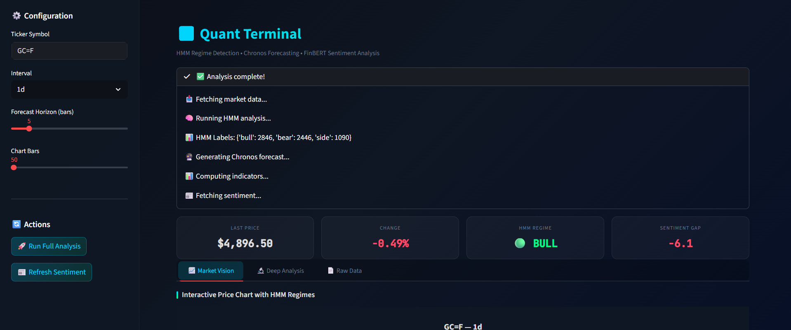
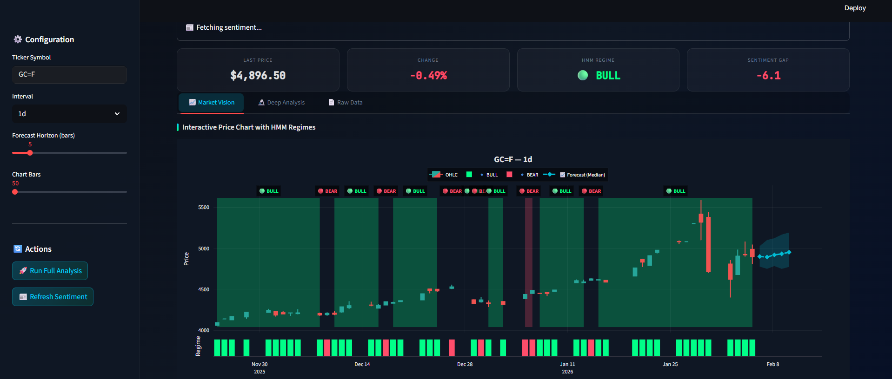
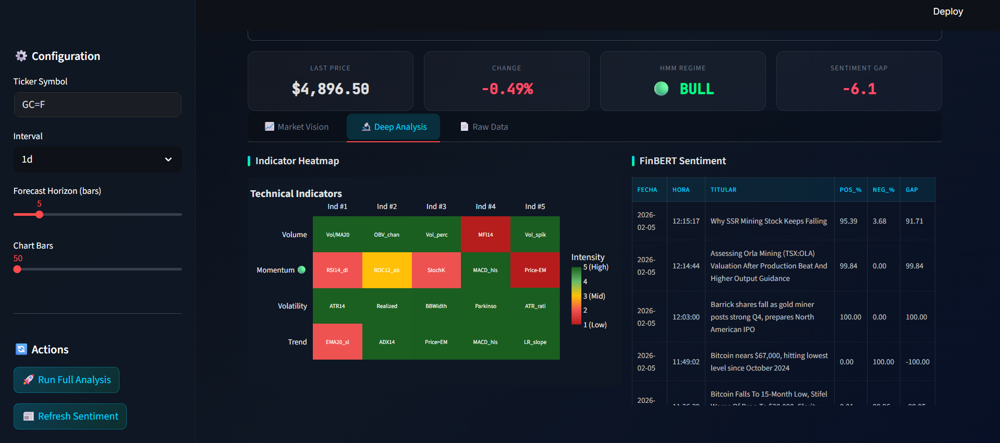
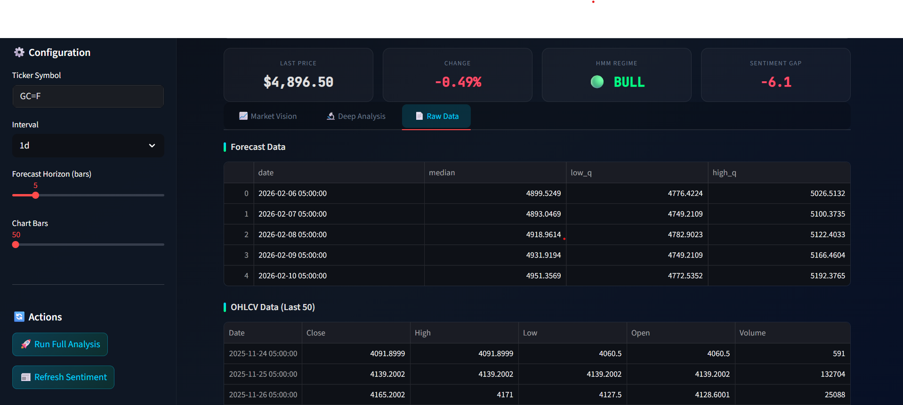

# 📊 Quant Terminal: HMM + Chronos + FinBERT

Este proyecto es un **Dashboard Cuantitativo de Alto Rendimiento** diseñado para el análisis técnico, predictivo y de sentimiento de activos financieros. Combina arquitecturas de aprendizaje profundo (Deep Learning), modelos probabilísticos de estados ocultos (HMM) y procesamiento de lenguaje natural (NLP) para ofrecer una visión 360° del mercado.

---

## 🛠 Arquitectura y Metodología

El terminal se basa en tres pilares fundamentales que operan de forma independiente pero integrada:

### 1. Detección de Regímenes con HMM (Hidden Markov Models)
Utiliza la librería `hmmlearn` para segmentar el comportamiento del mercado en tres estados latentes: **Bull**, **Bear** y **Side**.

*   **Bull (Alcista):** 🟢 Periodos de retornos positivos y baja volatilidad.
*   **Bear (Bajista):** 🔴 Periodos de retornos negativos y alta volatilidad.
*   **Side (Lateral):** 🟡 Periodos de consolidación y equilibrio.

### 2. Predicción de Series Temporales con Chronos
Implementa **Chronos (Amazon)** para realizar predicciones de *Zero-Shot* tratando los precios como tokens de lenguaje. Proporciona una mediana de predicción y bandas de confianza (cuantiles 0.1 y 0.9).

### 3. Análisis de Sentimiento con FinBERT
Aprovecha un modelo **BERT especializado en Finanzas** para procesar noticias y calcular el **Sentiment Gap** (`pos` - `neg`).

---

## 🔬 Deep Analysis: Sentimiento e Indicadores Técnicos

El apartado de **Deep Analysis** permite una confluencia visual entre el pulso del mercado (noticias) y el impulso técnico (Heatmap).

---

## 💡 Casos de Uso y Aplicación Estratégica

Este terminal está diseñado para soportar la toma de decisiones basada en datos:

1.  **Detección de Cambio de Régimen (Swing Trading):** Utilizar el HMM para identificar transiciones de *Side* a *Bull*. Una entrada confirmada por un Sentiment Gap positivo reduce la probabilidad de falsos breakout.
2.  **Gestión de Riesgo (Hedging):** Al entrar en un régimen *Bear*, el modelo sugiere reducir exposición o buscar activos de cobertura, incluso si los indicadores técnicos de corto plazo muestran rebotes temporales.
3.  **Identificación de Divergencias:** Si el precio muestra una tendencia *Bull* pero el **FinBERT Sentiment Gap** es fuertemente negativo, el terminal alerta sobre una posible exuberancia no respaldada por fundamentales.

---

## ⚠️ Recomendaciones de Uso

*   **Confluencia Técnica:** No tome decisiones basadas en un solo modelo. La señal perfecta ocurre cuando el **HMM Regime**, la **Mediana de Chronos** y el **Heatmap de Intensidad** apuntan en la misma dirección.
*   **Bandas de Confianza:** Preste especial atención a la anchura de las bandas de Chronos. Bandas muy anchas indican una alta incertidumbre volumétrica; es mejor esperar a que el modelo "estreche" sus proyecciones.
*   **Temporalidad:** El modelo HMM es más robusto en temporalidades de **1h y 1d** debido al ruido estadístico en marcos menores.

---

## 📄 Raw Data y Proyecciones

Transparencia total en los cálculos mediante el acceso a los datos crudos y auditoría de señales.

---

## 🚀 Instalación y Uso

1.  Instala las dependencias: `pip install -r requirements.txt`
2.  Ejecuta la interfaz: `streamlit run quant_dashboard_streamlit_app.py`

---
**Disclaimer:** *Este dashboard es una herramienta de análisis estadístico y no constituye una asesoría financiera. El trading de activos implica un alto riesgo de pérdida de capital.*
