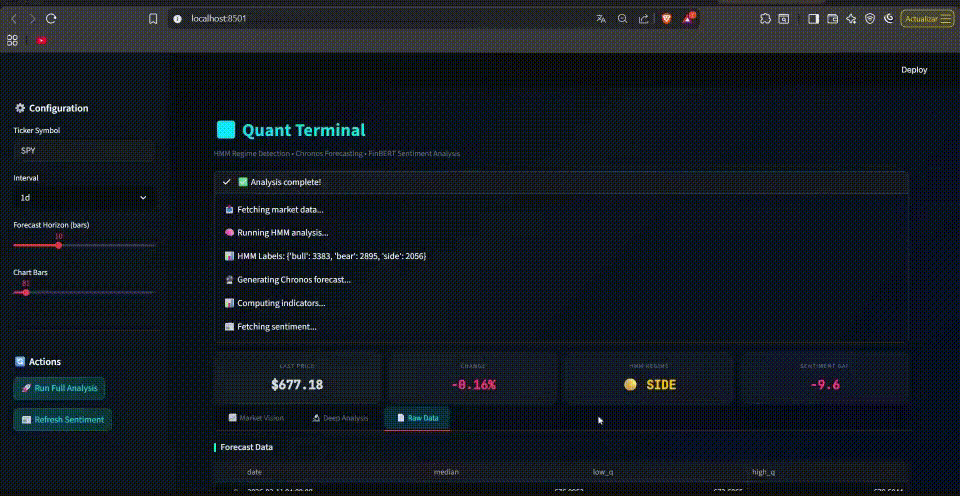
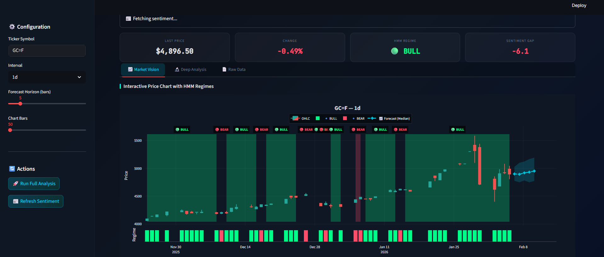
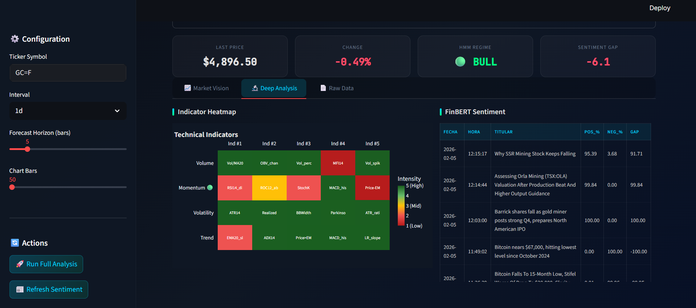
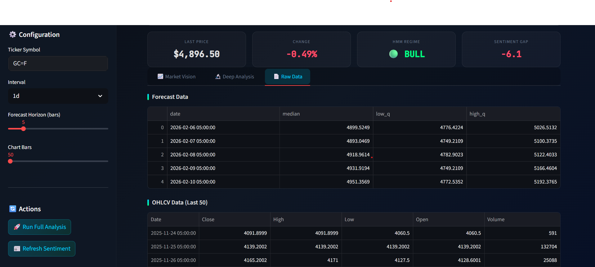

[English](README.md) | [Español](README.es.md) | [Português](README.pt.md) | [中文](README.zh.md)

---

# 📊 量化终端 (Quant Terminal): HMM + Chronos + FinBERT

本项目是一个**高性能量化仪表板**，专为金融资产的技术、预测和情绪分析而设计。它结合了深度学习 (Deep Learning) 架构、概率隐马尔可夫模型 (HMM) 和自然语言处理 (NLP)。

---

## 🛠 详细架构与方法论

为了保证计算的完全透明，该终端的方法论分为三个处理层：

### 1. 制度检测 (Hidden Markov Models / 隐马尔可夫模型)
HMM 模型基于数据的统计结构对市场进行划分，而不是依赖分析师的固定规则。

*   **输入变量 (特征):**
    *   `log_r`: 对数收益率（捕捉连续的百分比变化）。
    *   `range`: 期间内极差（最高价/最低价 - 1），即时波动性指标。
    *   `abs_r`: 收益率的绝对值（运动的强度）。
    *   `vol_5`: 短期波动率（5周期标准差）。
*   **算法:** 具有 3 个组件的 `GaussianHMM`。使用 **期望最大化 (Baum-Welch)** 算法训练状态。
*   **自动对齐:** 状态根据平均收益自动映射：
    *   **Bear (熊市/下跌):** 平均收益最低的状态。
    *   **Bull (牛市/上涨):** 平均收益最高的状态。
    *   **Side (盘整):** 中间状态。
*   **前向验证 (Walk-Forward):** 定期重新训练模型（滚动窗口），以适应市场中的结构性变化 (Structural Breaks)。

### 2. 概率预测 (Chronos)
**Chronos** 是亚马逊的一种 Transformer 架构，旨在将时间序列像语言一样处理。

*   **方法:** 将价格量化为通证 (Tokens)，并预测下一个值的概率分布。
*   **零样本学习 (Zero-Shot Learning):** 不依赖于经典形态（如头肩顶）； 它理解大规模内在的时间动态。
*   **不确定性:** 图表中的阴影区域代表置信带（10% 和 90% 分位数）。如果置信带较窄，则表明模型对轨迹具有很高的信心。

### 3. 机构级 NLP (FinBERT)
利用经过数百万份金融文件预训练的 **BERT (Bidirectional Encoder Representations from Transformers)** 神经网络。

*   **情绪差距 (Sentiment Gap) 计算:** 
    *   提取每个类别的概率：`[积极, 消极, 中性]`。
    *   $\text{Gap} = (\text{Prob}_{\text{Pos}} - \text{Prob}_{\text{Neg}}) \times 100$。
    *   值为 **100** 表示绝对乐观，**-100** 表示绝对恐慌。

---

## 🌡️ 指标透明度 (热力图)

强度热力图使用以下指标集进行决策：

| 类别 | 指标 | 基础计算 |
| :--- | :--- | :--- |
| **Momentum (动量)** | RSI (14) | 相对强弱指数 (Wilder)。 |
| | ROC (12) | 12周期的变化率。 |
| | Stochastic K | 随机指标 (14, 3)。 |
| | MACD Hist | MACD 线与其信号线的差值。 |
| **Volatility (波动性)** | ATR (14) | 真实波动幅度。 |
| | Realized Vol | 收益的移动标准差。 |
| | BB Width | 布林带宽度（归一化）。 |
| | Parkinson | 基于最高/最低价的波动率（比基于收盘价更敏感）。 |
| **Trend (趋势)** | EMA (20) | 快速指数移动平均线。 |
| | ADX (14) | 平均定向指数（趋势强度）。 |
| | Price vs EM | 价格相对于其移动平均线的位置。 |
| **Volume (成交量)** | Vol/MA20 | 当前成交量与 20 天平均值的对比。 |
| | OBV Change | 能量潮指标的变化。 |
| | Vol Spike | 检测异常成交量激增。 |

---

## 💡 使用策略与建议

*   **技术汇合:** 寻找“三重验证”：牛市制度 (HMM) + 看涨预测 (Chronos) + 情绪差距 > 10 (FinBERT)。
*   **热力图解读:** “Trend”和“Momentum”中均匀的绿色色块证实了健康的趋势。“Volatility”中的红色色块通常预示着平静期的到来。
*   **风险:** AI 模型具有概率性。在没有适当止损管理的情况下，切勿仅以此终端作为执行交易的唯一来源。

---

## 📄 原始数据与数据审计 (Raw Data)

通过对模型使用的原始数据和资产历史记录的访问，实现计算的完全透明化。

---

## 🚀 安装

1.  安装依赖项: `pip install -r requirements.txt`
2.  运行: `streamlit run quant_dashboard_streamlit_app.py`

---
**免责声明:** *此仪表板是一种统计分析工具，不构成金融建议。*
